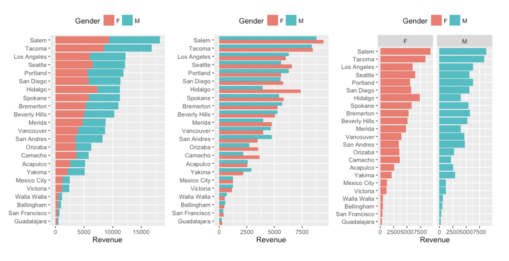

```{r xaringan-themer, include = FALSE}
# # library(xaringanthemer)
# duo(
#   primary_color = "#fff0f7", secondary_color = "#2F4F2F",
#   #header_font_google = google_font("Josefin Sans"),
#   text_font_google   = google_font("Montserrat", "300", "300i"),
#   code_font_google   = google_font("Droid Mono")
# )
```

```{r include = FALSE}
library(tidyverse)
library(readr)

```

# Housekeeping
- HW1 due today

- Join Slack! (and #labs channel)
---
class: center, middle, inverse
# Why Visualization Matters
## Communication and Design
---
# What does ggplot stand for?

--
- Grammar of Graphics (Hadley Wickham [paper](https://vita.had.co.nz/papers/layered-grammar.pdf) on its application in ggplot)

# Okay, what does that mean?
- These plots (from [UC Business Analytics Guide - Cleveland Dot Plots](https://uc-r.github.io/cleveland-dot-plots)) have the same underlying data - how do you describe the differences?


---
# Okay, what does that mean? (cont'd)

--
- "A grammar that can be used to describe and construct a wide range of
statistical graphics" - gives us a common framework for describing elements of plots
- Hadley Wickham expanded on this concept by proposing building a graphic from multiple layers of data; a *layered* grammar of graphics

> "To be precise, the layered grammar defines the components of a plot as:

> - a default dataset and set of mappings from variables to aesthetics,
> - one or more layers, with each layer having one geometric object, one statistical transformation, one position adjustment, and optionally, one dataset and set of aesthetic
mappings
> - one scale for each aesthetic mapping used,
> - a coordinate system
> - the facet specification"

> *A Layered Grammar of Graphics*, Hadley Wickham

---
class: center, middle, inverse
# Let's look at each of these in practice
---
# A default dataset - UN data on gender ratios in education

```{r}
ratio_ed <- read_csv('data/UN_Gender_Ratio_Education.csv')
```
---
# A default dataset - UN data on gender ratios in education
```{r}
head(ratio_ed,3)
```

---
# Pause for Wrangling Interlude

How do we...

- Drop the footnotes and source columns?

--
```{r}
ratio_ed <- select(ratio_ed, 1:5)
```

- Rename the variable that was read in as X2?

--
```{r}
#rename function
ratio_ed <- rename(ratio_ed, LongPlaceName = X2)
```


- Rename the variable Series?
--
```{r}
ratio_ed <- rename(ratio_ed, EdLevel = Series)
```


- Rename the Region/Country/Area variable?
--
```{r}
#non tidyverse way
names(ratio_ed)[names(ratio_ed) == 
                  "Region/Country/Area"] <- "PlaceCode"
```
---
# Pause for Wrangling Interlude (cont'd)
How do we...

- Make the necessary variables (PlaceCode, LongPlaceName, EdLevel) into factor?
--
```{r}
ratio_ed <- ratio_ed %>%
  mutate_at(c('PlaceCode', 'LongPlaceName', 'EdLevel'), as.factor)
```

Note that `mutate_at()` is used for variables selected with a character vector or `vars()`

---
# Pause for Wrangling Interlude (cont'd again)

How do we...

- Rename the factor levels of ratio?

--
```{r}
ratio_ed <- ratio_ed %>%
  mutate(EdLevel = recode(
    EdLevel, 
    'Ratio of girls to boys in primary education' = 'Primary Ratio',
    'Ratio of girls to boys in secondary education' = 'Secondary Ratio',
    'Ratio of girls to boys in tertiary education' = 'Tertiary Ratio'))
```

---
# "A default dataset" - Finally
```{r}
primaryAll <- ratio_ed %>%
  filter(EdLevel == 'Primary Ratio' & PlaceCode == 1)
```

You can also pipe directly into ggplot (but can't use the pipe after the ggplot() function)

```{r eval = FALSE}
ggplot(data = ratio_ed)
```

```{r out.width = 200, fig.align = 'center'}
#same output - blank figure
ratio_ed %>%
  filter(EdLevel == 'Primary Ratio' & PlaceCode == 1) %>%
  ggplot()
```

---
# Quick Note
These plots aren't supposed to be the most aesthetically pleasing or the most meaningful plots - just trying to show the progression of the grammar of graphics.

---
# "And a set of mappings from variables to aesthetics"
Define the variables you want to appear in your base plot (may be >2)

Why is there still no plot?
```{r out.width = 300, fig.align = 'center'}
ggplot(data = primaryAll, aes(x = Year, y = Value))
```
---
class: center, middle, inverse
## "One or more layers, with each layer having..."

---
# "One geometric object..."
```{r out.width = 450, fig.align = 'center'}
ggplot(data = primaryAll, aes(x = Year, y = Value)) +
  geom_point() #<<
```

---
# Does this code output something different?
```{r eval = FALSE}
ggplot(data = primaryAll) + #note the x and y are now defined
                            #in the geom
  geom_point(aes(x = Year, y = Value)) #<<
```

--
Nope!
```{r echo = FALSE, out.width = 390, fig.align = 'center'}
ggplot(data = primaryAll) +
  geom_point(aes(x = Year, y = Value))
```

---
# Note about geoms

There are a LOT of available geoms - you can "draw" almost anything in R. I'm not going to list them all here but keep in mind that you can layer them to get a given effect and also that you can import additional ones with external packages.
---
# "One statistical transformation..."
- What does the stat argument do here?
- Is this plot meaningful?
```{r out.width = 400, fig.align = 'center'}
ggplot(data = primaryAll, aes(x = Year, y = Value)) + 
  geom_bar(stat = 'identity') #<<
```
---
# "One statistical transformation..."
- What does the stat argument do here?
- Is this plot meaningful?
```{r out.width = 400, fig.align = 'center'}
ggplot(data = primaryAll) + 
  geom_bar(aes(x = Year), stat = 'count') #<<
```

---
# "One position adjustment..."
`position_identity()` is the default position
```{r out.width = 400, fig.align = 'center'}
ggplot(data = ratio_ed, aes(x = Year, y = Value)) + 
  geom_point(position = position_jitter(2)) #<<
```

---
# "and optionally, one dataset and..."
```{r out.width = 400, fig.align = 'center'}
# say we want text positioned somewhere on our plot
Yr <- 2000
Val <- 0.93
Txt <- "The Year 2000 is missing"
text_example <- data.frame(Yr, Val, Txt)
```
---
# "and optionally, one dataset and..." (cont'd)
```{r out.width = 400, fig.align = 'center'}
ggplot(data = primaryAll) + 
  geom_point(aes(Year, Value)) + 
  geom_text(data = text_example, #<<
            aes(Yr, Val, label = Txt)) #<<
```

---
# "Optionally, one set of aesthetic mappings."
Aesthetic mappings describe how variables in the data are mapped to visual properties (aesthetics) of geoms

```{r out.width = 350, fig.align = 'center'}
ggplot(data = primaryAll) + 
  geom_point(aes(Year, Value), size = 3) + #<<
  geom_text(data = text_example, 
            aes(Yr, Val, label = Txt), size = 3, color = 'red') #<<
```
---
class: center, middle, inverse

#Additionally...
---
# "One scale for each aesthetic mapping used"
Map from levels in the data to aesthetic values
```{r out.width = 350, fig.align = 'center'}
pal <- c("red", "blue", "green", "black", "purple", "orange", "yellow")
ggplot(data = primaryAll) + 
  geom_point(aes(Year, Value,
                 color = factor(Year), #<<
                 size = 3)) +
  scale_color_manual(values = pal) #<<
```
---
# "A coordinate system"
```{r out.width = 350, fig.align = 'center'}
ggplot(data = primaryAll) + 
  geom_point(aes(Year, Value,
                 color = factor(Year),
                 size = 3)) +
  scale_color_manual(values = pal) + 
  coord_flip() #<<
```

---
# "The facet specification"
```{r eval = FALSE}
ggplot(data = primaryAll) + 
  geom_point(aes(Year, Value,
                 color = factor(Year),
                 size = 3)) +
  scale_color_manual(values = pal) + 
  facet_wrap(~Year) #<<
```
---
# "The facet specification"
```{r echo = FALSE}
ggplot(data = primaryAll) + 
  geom_point(aes(Year, Value,
                 color = factor(Year),
                 size = 3)) +
  scale_color_manual(values = pal) + 
  facet_wrap(~Year) #<<
```

---
# Labels, legends and themes
Note this is the first plot that gets close to the design specifications that will be expected from your plots in the homework!
```{r eval = FALSE}
ggplot(data = primaryAll) +
  geom_point(aes(Year, Value)) +
  theme_minimal() + #<<
  labs(title = "Average Gender Ratio in Primary Education by Year", #<<
       subtitle = 'The average global gender ratio in primary education #<<
       has increased over time', #<<
       caption = "Source: UN Statistics", #<<
       x = 'Year', #<<
       y = 'Average Global Gender Ratio') #<<
```
---
# Labels, legends, and themes
```{r echo = FALSE, fig.align = 'center'}
ggplot(data = primaryAll) +
  geom_point(aes(Year, Value)) +
  theme_minimal() +
  labs(title = "Average Gender Ratio in Primary Education by Year",
       subtitle = 'The average global gender ratio in primary education has increased over time',
       caption = "Source: UN Statistics",
       x = 'Year',
       y = 'Average Global Gender Ratio')
```
---
Class: center, middle, inverse
# Identifying plot layers

---
```{r echo = FALSE, fig.align = 'center', out.width = 550}
ratio_ed %>%
  filter(PlaceCode == 1) %>%
  mutate(factor(Year)) %>%
  ggplot(aes(x = EdLevel, y = Value)) + 
  geom_point(aes(color = EdLevel)) +
  facet_wrap(~Year) +
  labs(title = 'Comparing Global Gender Ratios in Primary, Secondary, and Tertiary\nEducation by Year',
       caption = 'Source: UN Data',
       y = 'Global Gender Ratio',
       color = 'Education Level') +
  theme_light() + 
  theme(axis.text.x = element_blank(),
        axis.title.x = element_blank()) +
  scale_color_brewer(palette = 'Accent')
```
---
# Resources/Activities
- [R Graph Gallery](https://www.r-graph-gallery.com/index.html)

- [Tidy Tuesday](https://github.com/rfordatascience/tidytuesday)

- [A ggplot2 tutorial for beautiful plotting in R](https://cedricscherer.netlify.com/2019/08/05/a-ggplot2-tutorial-for-beautiful-plotting-in-r/)

- (Book) **Data Points: Data Visualization that Means Something**, especially chapters 3 and 5 (available for free through O'Reilly/Georgetown Library)
---
class: center, middle, inverse
# Let's talk directories
## Specifically in R Markdown