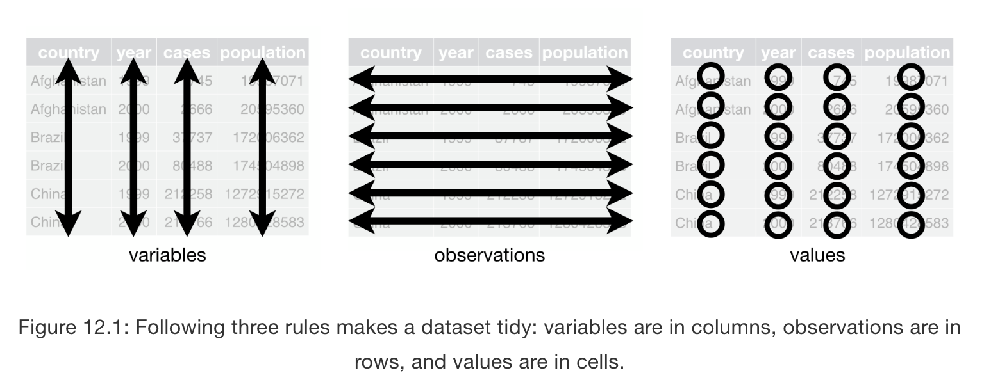

# Logistics and Changes from Last Semester

- Labs (and participation in labs) are now mandatory and I will be taking attendance :( BUT you no longer have to submit anything related to labs :)

- Every week 4-5 pm in ON G-02

- Labs will emphasize the tidyverse more than base R

- Labs will be (hopefully) more applied

- Problem set submissions will now also include grading on presentation; plots need to follow visualization principles, code should not be cut off, all code/LaTeX should render correctly, and assignments **must be rendered as a PDF from an R Markdown file** (submit a hard copy of the PDF in class and the PDF version on Canvas)

- Join Slack!

---
# Shameless Plugs

- RSVP for resume review event by Friday at 5 pm! (https://tinyurl.com/dspp-resume-review)

- Fill out last semester's TA feedback form (or forever hold your peace) (https://tinyurl.com/ta-feedback-560)

---
# Necessary packages

```{r, eval = FALSE}
install.packages('tidyverse')
library(tidyverse)
```

```{r, include = FALSE}
library(tidyverse)
```

"Umbrella package" that will include `tidyr`, `dplyr`, `ggplot2`, and other useful packages. We'll mostly be working with these three for the next few weeks.

---
# Disclaimer

- I am mostly self-taught on wrangling in R (affects my pronunciation, code efficiency, etc)

- Will send out resources that I reference regularly; I recommend you refer to these in addition to lab slides/code

- This will probably just be a review of what you covered in class; want to reinforce

---
# What is Data Wrangling?

--
Transforming or mapping data from one "raw" form into another form to make it more valuable for analysis.

- Import and export
- Deal with missing values
- Subset observations
- Summarize variables
- Make new variables
- Group data
- Combine data

Use cases for these?

--
- Import data so that data types are correct
--
- Evaluate NA values
--
- Focus only on certain variables (subset of columns that meet a condition) or data points (subset of rows that meet a condition)
--
- Calculate averages or maximum values for a variable
--
- Create a dummy variable indicating whether a condition is true
--
- Perform calculations based on group membership
--
- Merge a bunch of datasets
---
class: center, middle

# Today's Data

---
# Reading in Data - how does readr parse this file?
Note the output of `read_csv` is a tibble, not a df
```{r}
read_csv('data/fafsa-demographics-2017-18.csv')
```

---
# Reading in Data - specifying NA
```{r}
read_csv('data/fafsa-demographics-2017-18.csv', na = "N/A")
```
---
# Reading in Data - specifying col types
```{r}
read_csv('data/fafsa-demographics-2017-18.csv', na = "N/A",
           col_types = cols(.default= col_number(),
                            Variable = col_character()
  ))
```

---
# We have a tibble! What do we notice?
```{r}
d <- read_csv('data/fafsa-demographics-2017-18.csv', na = "N/A",
           col_types = cols(.default= col_number(),
                            Variable = col_character()
  ))

head(d)
```

---
# "Tidy" Data - What is it?

> There are three interrelated rules which make a dataset tidy:

> - Each variable must have its own column.

> - Each observation must have its own row.

> - Each value must have its own cell.
 
> (Image and Quote from 'R for Data Science', Hadley Wickham')


---
# What do we need to do to make this data tidy?
```{r}
head(d)
```
---
# Switch rows/columns (currently variables are rows and observations are columns)
```{r}
#convert tibble to matrix and transpose
dmatrix <- t(as.matrix(d))

#select first row of data to serve as column names
column_names <- dmatrix[1,]

#remove that row in the data
dmatrix <- dmatrix[-1,]

#add column names in place of R-generated ones
colnames(dmatrix) <- column_names

#convert transposed matrix back to tibble
d_transposed <- as_tibble(dmatrix)
head(d_transposed)
```
---
class: center, middle
# There must be a more efficient way...
---
# Pipes!
```{r, eval = FALSE}
x %>% f(y)
```
is equivalent to:

```{r, eval = FALSE}
f(x,y)
```
---
# The Old (Base R) Way
```{r, eval = FALSE}
# this is pseudocode
d <- import_data()
d2 <- operation_on_first_df(d)
d3 <- operation_on_the_new_df(d2)
d4 <- operation_on_the_new_new_df(d3)
d4 <- accidentally_overwriting_a_variable(d2)
d5 <- repeating_work(d3)
```

This is essentially what we just did to transpose that matrix
---
# The Pipe Way
```{r, eval = FALSE}
#still pseudocode
d <- import_data() %>%
  first_operation() %>%
  second_operation() %>%
  final_operation()
  
```

- No need to save additional variables; less confusion, less computation
- "Focus on verbs, not nouns" - read code like set of actions rather than series of variables

---
# Apply the Pipe to transpose the data (you could also use gather/spread)
```{r}
d_pipe_transposed <- d %>%      # take original data
  select(-1) %>%                # remove first column
                                # (our eventual rownames)
  t() %>%                       # transpose 
  data.frame()                  # turn back into data frame

#rename the columns 
colnames(d_pipe_transposed) <- column_names 

head(d_pipe_transposed)
```

---
# Subset Columns with select()

- Hint: we just used this in the piping above
- `Select` is used for **columns** of data; say we don't want all 80 columns
- Use with ["helper functions"](https://r4ds.had.co.nz/transform.html#select) to match certain column name characteristics, reorder or rename columns
- Drops all variables not explicitly named
- Note use of the pipe vs "normal" function arguments

```{r}
only_gender <- d_pipe_transposed %>%
  select(Female, Male, Gender_Blank)

#alternate method without pipe
only_gender_2 <- select(d_pipe_transposed, Female, Male, Gender_Blank)

print(only_gender)
```

---
# Subset rows with filter()
- `Filter()` is used for **rows** of data
- Used to select rows that meet a given condition
- Note that this condition was determined by inspection of the dataset; not robust

```{r}
only_quarters <- only_gender %>%
  filter(Gender_Blank < 100000)

# non-pipe way
only_quarters2 <- filter(only_gender, Gender_Blank < 100000)

print(only_quarters)
```

---
# Summarize() function
- Collapses a dataframe to a single row
- Generally paired with group_by() (change unit of analysis from full dataset to group)

```{r}
averages_gender <- only_quarters %>%
  summarize(women_avg = mean(Female, na.rm = TRUE),
            male_avg = mean(Male, na.rm = TRUE),
            gender_blank_avg = mean(Gender_Blank, na.rm = TRUE))

print(averages_gender)
```

Not that useful
---
# Mutate() function
- `mutate()` is used to add new variables (specifically, columns that are functions of existing columns)
- always adds columns to the end of a dataset
- Let's create a variable for male-female ratio, for a male-female ratio <0.5 (note you can refer to variables you just created), and for a non-response rate greater than the average (you can combine logical filtering through `ifelse()`)
- `transmute()` works like mutate but lets you keep only the variables you just created

```{r}
gender_new <- only_quarters %>%
  mutate(m_f_ratio = round(Male / Female, 2),
         low_mf_ratio = ifelse(m_f_ratio < 0.5, 1, 0),
         high_nonresponse = ifelse(Gender_Blank <= mean(Gender_Blank), 1, 0))

gender_new
```

---
# Group_by() function
- applies dplyr verbs "by group"; the unit of analysis is now the group rather than the full data
- really useful for categorical or dummy variable data, and useful in combination with summary; can also use with `filter()` to find group members that meet a given criteria or find groups in relation to a threshold, or `mutate()` to compute per group metrics
- let's look at average applications grouped by either high response rate or low response rate

```{r}
averages_by_response <- gender_new %>%
  group_by(high_nonresponse) %>%
  summarize(women_avg = mean(Female, na.rm = TRUE),
            male_avg = mean(Male, na.rm = TRUE),
            gender_blank_avg = mean(Gender_Blank, na.rm = TRUE))

averages_by_response
```

---
# Combining Datasets

Can use these functions:
- `left_join()` to join matching rows from b to a
- `right_join()` to join matching rows from a to b
- `inner_join()` to retain only rows in both sets
- `full_join()` to retain all values, all rows
- `bind_rows()` to append z to y as new rows
- `bind_cols()` to append z to y as new cols

---
# Takeaways

### Wrangling is really task-dependent, but the core functions are similar (in tidyverse)
---
class: center, middle
# Working on Online Exercises

## http://ericdunford.com/ppol561/
